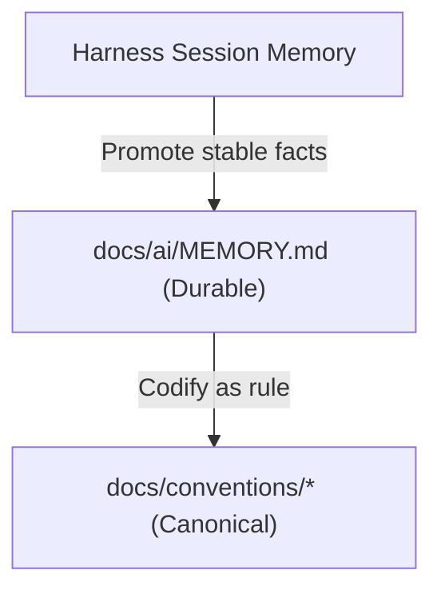

# Memory Layer

Pumni Web OS uses a hybrid memory layer designed for 2026-era agent execution. It balances harness-managed session context with a tool-agnostic committed log.

## Three-Tier Hybrid Model

1. **Session Memory — Harness-Managed (Primary)**
   Claude Code and modern AI execution environments provide built-in session compaction, memory tools, and subagent memory. This is the **active working memory** of the session. The agent depends on the harness to maintain session state across long multi-turn conversations.

2. **Durable Long-Term — `docs/ai/MEMORY.md` (Committed)**
   Durable, settled facts: conventions, architecture choices not yet in convention files, and critical context pointers. Facts are **promoted** here from session memory when they prove durable. This is committed to Git and acts as the tool-agnostic SSOT readable by any harness.

3. **Canonical Docs — `docs/conventions/*`, `docs/architecture/*`**
   The final home of rules. When a fact in `MEMORY.md` becomes a permanent project convention, it is promoted to a convention file (e.g. `supabase-security.md`) and removed from `MEMORY.md`.

*Note: The manual scratchpad (`.agents/scratchpad/`) remains supported only as a fallback for harnesses lacking managed memory.*

## Compaction & Promotion Flow

As a conversation progresses, facts move through the memory tiers:

1. **Active session:** The agent works within the session memory.
2. **Promote to Durable:** When a critical design choice or fact is established, write it to the Decisions Log of `docs/ai/MEMORY.md` (see the decisions section in `MEMORY.md`).
3. **Codify to Canonical:** During maintenance passes, look at `MEMORY.md` log entries and compile them into convention or architecture docs if they are permanent rules.
